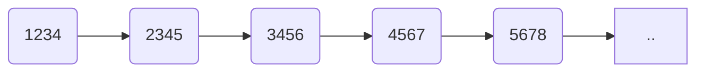
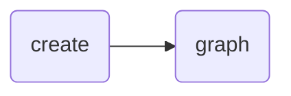
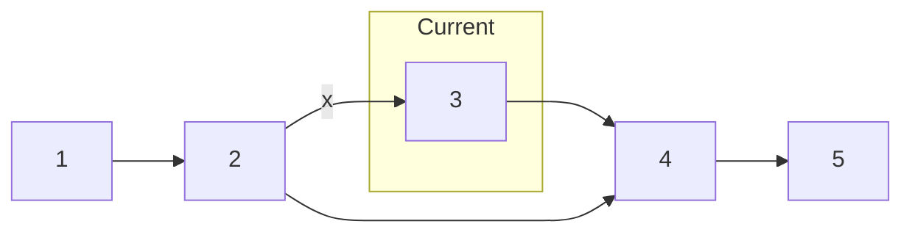

The Python system library's inbuilt data types are all you need in most cases.
However, there are some instances when you might want to extend one of them or even better -
create one yourself.

In this post, we are going to learn how to create our own data structures
from scratch.

#### PREREQUISITES
- Familiarity with Python
- Some Programming Knowledge

#### Goals
- Implement a linked list

#### Contents

## Linked Lists

There are very few occasions when you might want to use a linked list instead of Python's own [list]() data structure. However, this simple data structure makes for a great starting point for us.

A linked list is quite possibly, the simplest example of a [dynamic data structure](). Linked lists are composed of a chain of nodes liked together by pointers.

### The `Node` Class

A basic **node** in a linked list is a composite data structure containing two parts: a value, and a pointer to the next node in the list.

```py
class Node:
  def __init__(self, input_data):
    self.data = input_data
    self.next = None
```
To create a `Node` object:

```python
>>> temp = Node(90)
>>> temp.data
90
```

I am going to continue with this bare-bones `Node` class but if you want, you can add getters and setters to the class like below.

```python
class Node:
    def __init__(self, input_data):
        self.data = input_data
        self.next = None

    def getData(self):
        return self.data

    def getNext(self):
        return self.next

    def setData(self,new_data):
        self.data = new_data

    def setNext(self,new_next):
        self.next = new_next
```
> This usually considered a good practice, but in Python, its utility is debatable.

A linked list can be visualized as a series of linked boxes, as seen in the below picture:


> While we often represent linked lists as a neat, orderly structures, but our list can actually be scattered throughout the program's memory.

Because they include pointers as well as values, linked lists typically require more
memory to store the same items than arrays. Instead of the absolute position, emphasis in a linked list is generally on the relative position of each element.

Now, let's create the `LinkedList` class.

```python
class LinkedList:
  def __init__(self, head=None):
    self.head = head
```
This will enable us to create a list like such:

```python
>>> new_list = LinkedList()
>>> new_list.head
None
```
There are no members here. Let's create the ability to add elements to the list.

```python
def add(self, data):
  temp = Node(data)
  temp.next = self.head
  self.head = temp
```
Notice that we are adding new members at the front of the linked list. First, we create a new `Node` object with data provided by the user and `next` is the `head` of our linked list. The newly added member now becomes our new `head`.

```python
>>> mylist = LinkedList()
>>> mylist.add(42)
>>> mylist.add(53)
>>> mylist.add(67)
>>> mylist.add(89)
>>> mylist.add(90)
>>> mylist.head.data
90
```



The next methods that we will implement are based on the technique known as **linked list traversal**. We will visit each node in the linked list, starting from the head, using the references stored in the `next` variable of each node.

Let's implement the `size` method using this technique.

```python
def size(self):
  current_node = self.head
  count = 0
  while current_node:
    size += 1
    current_node = current_node.next
  return count
```
In the above method, we store the number of nodes we have visited in the `count` variable. Our loop will end once the `next` variable of the `current_node` is empty, which means there are no more nodes to be visited.

We can modify this method a little to implement a `contains` method, which returns `true` or `false`, depending on if the value provided by the user is in the list or not.

```python
def contains(self, value):
  current_node = self.head
  while current_node:
    if current_node.data == value:
      return True
    else:
      current_node = current_node.next
  return False
```

In this method, while we visit each node, we also check if the value provided is equal to the data stored in the `current_node`. If we get a match, we return `True`, otherwise, the loop ends after the last node and we return `False`.

```python
>>> mylist.contains(67)
True
```
The next method we will implement is the `remove` method. First, we will traverse the list looking for the item that we want to remove. Once we find the item, we must remove it.

Finding the item is very similar to the above method but how do we remove it? One approach is to delete the data but keep the node. This doesn't work because it may break our other methods. The best approach would be to remove the node altogether, like so.



Here, we can set the next of the second node to the fourth node and that's it, our node is deleted. However, once we match with the third node, we will no longer have the second node stored in the traversal technique. We can modify it to store the previous node as well.

```python
def remove(self, value):
  current_node = self.head
  previous_node = None
  while current_node:
    if current_node.data == value:
      break
    else:
      previous_node = current_node
      current_node = current_node.next

  if previous_node:
    previous_node.next = current_node.next
  else:
    # node to delete is the first node
    self.head = current_node.next  
```
