# Graphs in Python

In this post, we're going to implement a graph data structure from scratch in Python.

We'll create two different graph representations:

- An adjacency list
- An adjacency matrix

Along the way, we'll explore nodes, edges, weights, directed graphs, undirected graphs, and some of the design decisions involved in representing relationships between objects.

## PREREQUISITES

- Familiarity with Python
- Basic understanding of classes
- Some Programming Knowledge

## Goals

- Understand the basic components of a graph
- Implement a weighted graph using adjacency lists
- Implement a graph using an adjacency matrix
- Support directed and undirected graphs
- Compare the two graph representations

# Graphs

Graphs are among the most useful data structures in computer science.

They are used to represent relationships between objects.

For example, a social network can be represented as a graph where people are nodes and friendships are edges.

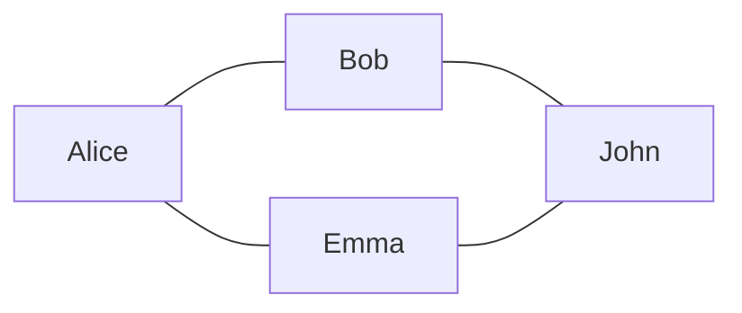

A road network can be represented as a graph where cities are nodes and roads are edges.

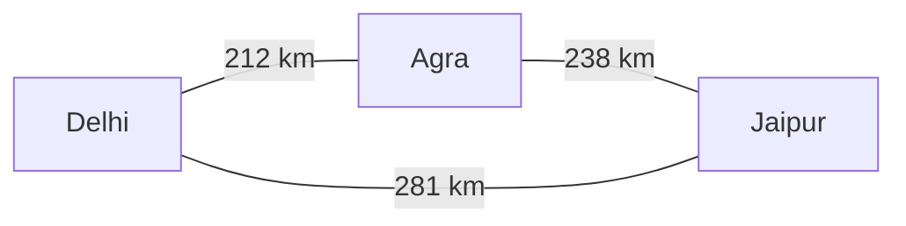

Graphs are also used in:

- Computer networks
- Recommendation systems
- Build systems
- Package managers
- Navigation systems
- Search engines
- Compilers
- Social networks

A graph consists of two primary components:

- **Vertices**, which are usually called nodes
- **Edges**, which connect the nodes

Let's start with an edge.

# The `Edge` Class

An edge represents a connection between two nodes.

For our implementation, an edge will contain three pieces of information:

- The node from which the edge starts
- The node at which the edge ends
- The weight of the edge

```python
class Edge:

    def __init__(self, from_node, to_node, weight):
        self.from_node = from_node
        self.to_node = to_node
        self.weight = weight
```

Let's create an edge.

```python
>>> edge = Edge(0, 1, 5)
```

This represents an edge from node `0` to node `1` with a weight of `5`.

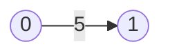

The meaning of the weight depends on the problem we're trying to solve.

It could represent:

- Distance between two cities
- Cost of travelling along a route
- Time required to complete a task
- Network latency
- Strength of a relationship

We can inspect the edge directly.

```python
>>> edge.from_node
0

>>> edge.to_node
1

>>> edge.weight
5
```

Our edge is ready.

Now we need something to connect.

# The `Node` Class

A node represents an object in our graph.

Each node will have:

- A numeric index
- An optional label
- A collection of outgoing edges

```python
class Node:

    def __init__(self, index, label=None):
        self.index = index
        self.edges = {}
        self.label = label
```

Let's create a node.

```python
>>> node = Node(0, label="Delhi")

>>> node.index
0

>>> node.label
'Delhi'
```

The `edges` dictionary will store the outgoing connections from this node.

```python
>>> node.edges
{}
```

We use a dictionary where the key is the index of the neighbouring node and the value is the corresponding `Edge` object.

For example:

```python
{
    1: Edge(0, 1, 5),
    2: Edge(0, 2, 8)
}
```

Using a dictionary allows us to quickly locate an edge when we already know the target node.

# Adding an Edge to a Node

Let's add a method for creating an outgoing edge.

```python
def add_edge(self, target, weight):
    self.edges[target] = Edge(
        self.index,
        target,
        weight
    )
```

The method creates an `Edge` object and stores it using the target node as the dictionary key.

```python
>>> node.add_edge(1, 5)
```

Our node now represents the following structure:


We can inspect the edge.

```python
>>> node.edges
{1: <__main__.Edge object at 0x...>}
```

That output isn't particularly helpful.

Let's add a representation to the `Edge` class.

```python
class Edge:

    def __init__(self, from_node, to_node, weight):
        self.from_node = from_node
        self.to_node = to_node
        self.weight = weight

    def __repr__(self):
        return (
            f"Edge({self.from_node}, "
            f"{self.to_node}, "
            f"weight={self.weight})"
        )
```

Now our edge is easier to understand.

```python
>>> node.edges
{1: Edge(0, 1, weight=5)}
```

Much better.

# Removing an Edge

Removing an edge from a node is simply a matter of deleting it from the dictionary.

```python
def remove_edge(self, target):
    del self.edges[target]
```

For example:

```python
>>> node.remove_edge(1)

>>> node.edges
{}
```

If the edge doesn't exist, Python will raise a `KeyError`.

If we want the method to silently ignore missing edges, we could instead use:

```python
def remove_edge(self, target):
    self.edges.pop(target, None)
```

For now, we'll keep the stricter version. Attempting to remove an edge that doesn't exist is probably a programming error, and raising an exception makes that problem visible.

# Getting an Edge

We can retrieve a particular edge using its neighbouring node.

```python
def get_edge(self, neighbor):
    return self.edges.get(neighbor)
```

Let's add an edge and retrieve it.

```python
>>> node.add_edge(1, 5)

>>> node.get_edge(1)
Edge(0, 1, weight=5)
```

If the connection doesn't exist, the method returns `None`.

```python
>>> node.get_edge(7)
None
```

# Getting All Edges

Sometimes we want all the outgoing edges from a node.

```python
def get_edges(self):
    return self.edges.values()
```

Let's add a couple of connections.

```python
>>> node.add_edge(1, 5)
>>> node.add_edge(2, 8)

>>> list(node.get_edges())
[Edge(0, 1, weight=5), Edge(0, 2, weight=8)]
```

Notice that we're returning a dictionary values view rather than creating another list.

The caller can still create a list if required:

```python
list(node.get_edges())
```

However, we avoid creating an unnecessary copy when the caller only wants to iterate over the edges.

# Counting Edges

The number of outgoing edges is simply the size of our dictionary.

```python
def num_edges(self):
    return len(self.edges)
```

Now:

```python
>>> node.num_edges()
2
```

We could also expose this through Python's Data Model.

```python
def __len__(self):
    return len(self.edges)
```

This lets us write:

```python
>>> len(node)
2
```

Both approaches are valid. The second one makes our object feel more like a native Python collection.

# Getting the Neighbours

A neighbour is any node connected to the current node by an outgoing edge.

```python
def get_neighbors(self):
    neighbors = set()

    for edge in self.edges.values():
        neighbors.add(edge.to_node)

    return neighbors
```

For our current node:

```python
>>> node.get_neighbors()
{1, 2}
```

The structure looks like this:

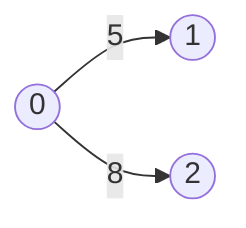

We return a set because every neighbour should appear only once.

Since our edges are already stored in a dictionary keyed by the target node, this method could also be written more simply:

```python
def get_neighbors(self):
    return set(self.edges)
```

This is one of the benefits of selecting an appropriate internal representation. Sometimes a good representation makes several operations almost trivial.

# Sorting the Edges

We can also return the edges sorted by the index of their target node.

```python
def get_sorted_edge_list(self):
    result = []

    for neighbor in sorted(self.edges):
        result.append(self.edges[neighbor])

    return result
```

For example:

```python
>>> node = Node(0)

>>> node.add_edge(5, 10)
>>> node.add_edge(2, 7)
>>> node.add_edge(3, 4)

>>> node.get_sorted_edge_list()
[
    Edge(0, 2, weight=7),
    Edge(0, 3, weight=4),
    Edge(0, 5, weight=10)
]
```

The edges are sorted by the target node, not by their weights.

If we wanted to sort by weight instead, we could write:

```python
def get_edges_sorted_by_weight(self):
    return sorted(
        self.edges.values(),
        key=lambda edge: edge.weight
    )
```

Now that we have nodes and edges, let's build a graph.

# The `Graph` Class

Our first graph implementation will use an **adjacency list**.

```python
class Graph:

    def __init__(self, num_nodes, undirected=False):
        self.num_nodes = num_nodes
        self.undirected = undirected
        self.nodes = [
            Node(index)
            for index in range(num_nodes)
        ]
```

Creating a graph with five nodes:

```python
>>> graph = Graph(5)
```

produces:


There are five nodes, but there are no connections yet.

Every node is assigned an index based on its position in the `nodes` list.

```python
>>> graph.nodes[0].index
0

>>> graph.nodes[4].index
4
```

# Validating Node Indices

Before adding or retrieving an edge, we need to make sure both node indices exist.

```python
def _verify_node_indices(self, from_node, to_node):

    if from_node < 0 or from_node >= self.num_nodes:
        raise IndexError("Source node is out of range")

    if to_node < 0 or to_node >= self.num_nodes:
        raise IndexError("Target node is out of range")
```

Now invalid indices produce a useful error.

```python
>>> graph.get_edge(0, 10)
IndexError: Target node is out of range
```

The leading underscore in `_verify_node_indices` indicates that this is an internal helper method.

It doesn't make the method private, but it tells other developers that the method is intended for internal use.

# Adding Edges

Let's add a method for connecting two nodes.

```python
def insert_edge(self, from_node, to_node, weight):
    self._verify_node_indices(from_node, to_node)

    self.nodes[from_node].add_edge(
        to_node,
        weight
    )

    if self.undirected:
        self.nodes[to_node].add_edge(
            from_node,
            weight
        )
```

For a directed graph, the edge is added only to the source node.

```python
>>> graph.insert_edge(0, 1, 5)
```


The arrow is important.

Node `0` connects to node `1`, but node `1` doesn't automatically connect back to node `0`.

```python
>>> graph.get_edge(0, 1)
Edge(0, 1, weight=5)

>>> graph.get_edge(1, 0)
None
```

# Directed Graphs

A directed graph contains edges with a specific direction.

Consider a dependency system.


Testing depends on compilation, and deployment depends on testing.

These relationships aren't necessarily reversible.

A directed flight route provides another example.

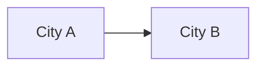

A flight from City A to City B doesn't automatically mean there is a corresponding flight from City B to City A.

# Undirected Graphs

In an undirected graph, an edge represents a connection in both directions.

We can create one by passing `undirected=True`.

```python
>>> network = Graph(3, undirected=True)

>>> network.insert_edge(0, 1, 5)
```

Internally, the graph creates two directed edges:

```python
0 -> 1
1 -> 0
```

Together, they represent one undirected relationship.

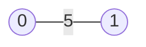

Now both lookups succeed.

```python
>>> network.get_edge(0, 1)
Edge(0, 1, weight=5)

>>> network.get_edge(1, 0)
Edge(1, 0, weight=5)
```

# Building a Weighted Graph

Let's create a more interesting graph.

```python
>>> graph = Graph(5)

>>> graph.insert_edge(0, 1, 5)
>>> graph.insert_edge(0, 2, 3)
>>> graph.insert_edge(1, 3, 1)
>>> graph.insert_edge(2, 3, 6)
>>> graph.insert_edge(2, 4, 8)
>>> graph.insert_edge(3, 4, 2)
```

The result looks like this:

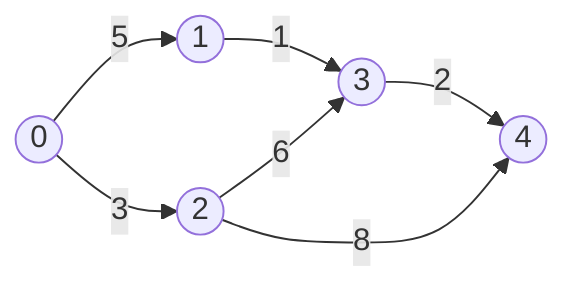

The same graph can be described as an adjacency list.

```text
0 -> (1, 5), (2, 3)
1 -> (3, 1)
2 -> (3, 6), (4, 8)
3 -> (4, 2)
4 ->
```

Each row tells us which nodes can be reached directly from a particular node.

# Getting an Edge from the Graph

Our graph delegates edge retrieval to the corresponding node.

```python
def get_edge(self, from_node, to_node):
    self._verify_node_indices(from_node, to_node)
    return self.nodes[from_node].get_edge(to_node)
```

Now:

```python
>>> graph.get_edge(0, 2)
Edge(0, 2, weight=3)
```

If the edge doesn't exist:

```python
>>> graph.get_edge(4, 0)
None
```

# Checking Whether an Edge Exists

We can build a convenience method on top of `get_edge`.

```python
def is_edge(self, from_node, to_node):
    return self.get_edge(from_node, to_node) is not None
```

Now:

```python
>>> graph.is_edge(0, 2)
True

>>> graph.is_edge(4, 0)
False
```

Notice that we didn't duplicate our lookup logic.

Whenever possible, it's usually better to build new functionality using methods we've already tested.

# Creating an Edge List

Sometimes we need a single list containing every edge in the graph.

```python
def make_edge_list(self):
    edges = []

    for node in self.nodes:
        for edge in node.get_edges():
            edges.append(edge)

    return edges
```

Let's try it.

```python
>>> graph.make_edge_list()
[
    Edge(0, 1, weight=5),
    Edge(0, 2, weight=3),
    Edge(1, 3, weight=1),
    Edge(2, 3, weight=6),
    Edge(2, 4, weight=8),
    Edge(3, 4, weight=2)
]
```

This representation is particularly useful for algorithms that need to examine every edge.

# Removing an Edge

Removing an edge is similar to inserting one.

```python
def remove_edge(self, from_node, to_node):
    self._verify_node_indices(from_node, to_node)

    self.nodes[from_node].remove_edge(to_node)

    if self.undirected:
        self.nodes[to_node].remove_edge(from_node)
```

For a directed graph, only one edge is removed.

```python
>>> graph.remove_edge(0, 1)

>>> graph.is_edge(0, 1)
False
```

For an undirected graph, we remove both internal edges.

```python
>>> network = Graph(3, undirected=True)
>>> network.insert_edge(0, 1, 5)

>>> network.remove_edge(0, 1)

>>> network.is_edge(0, 1)
False

>>> network.is_edge(1, 0)
False
```

# Adding a Node

Let's allow the graph to grow after it has been created.

```python
def insert_node(self, label=None):
    node = Node(self.num_nodes, label=label)

    self.nodes.append(node)
    self.num_nodes += 1

    return node
```

Now:

```python
>>> graph = Graph(3)

>>> graph.insert_node(label="New Node")
New Node
```

Our graph now contains four nodes.

```python
>>> graph.num_nodes
4

>>> graph.nodes[3].label
'New Node'
```

Let's add a useful representation to `Node`.

```python
def __repr__(self):
    if self.label is not None:
        return str(self.label)

    return f"Node({self.index})"
```

Now labelled nodes display their labels, while unlabelled nodes display their indices.

```python
>>> graph.nodes[0]
Node(0)

>>> graph.nodes[3]
New Node
```

# Finding Incoming Neighbours

The edges stored inside a node tell us about its outgoing neighbours.

For example:

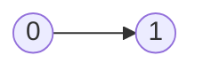

Node `1` is an outgoing neighbour of node `0`.

But what if we want to know which nodes point to node `1`?

These are called its **incoming neighbours**.

```python
def get_in_neighbors(self, target):

    if target < 0 or target >= self.num_nodes:
        raise IndexError("Target node is out of range")

    neighbors = set()

    for node in self.nodes:
        if target in node.edges:
            neighbors.add(node)

    return neighbors
```

Consider this graph:

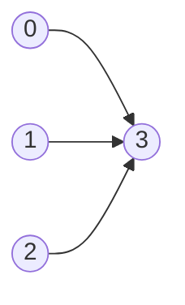

Calling:

```python
>>> graph.get_in_neighbors(3)
```

would return nodes `0`, `1`, and `2`.

The adjacency list makes outgoing-neighbour lookups easy. Finding incoming neighbours requires us to inspect the outgoing edges of every node.

This is an important trade-off in data structure design. A representation that makes one operation fast may make another operation more expensive.

# Copying a Graph

Let's create a copy of our graph.

```python
def make_copy(self):
    copied_graph = Graph(
        self.num_nodes,
        undirected=self.undirected
    )

    for node in self.nodes:
        copied_graph.nodes[node.index].label = node.label

    for edge in self.make_edge_list():
        copied_graph.insert_edge(
            edge.from_node,
            edge.to_node,
            edge.weight
        )

    return copied_graph
```

Now:

```python
>>> copied_graph = graph.make_copy()
```

The copied graph has its own nodes and edges.

```python
>>> copied_graph is graph
False

>>> copied_graph.nodes[0] is graph.nodes[0]
False
```

Changing the copy doesn't change the original.

```python
>>> copied_graph.remove_edge(0, 2)

>>> copied_graph.is_edge(0, 2)
False

>>> graph.is_edge(0, 2)
True
```

# Implementing the Python Data Model

We can add a few special methods to make our graph easier to use.

## Implementing `__len__`

The length of the graph is the number of nodes.

```python
def __len__(self):
    return self.num_nodes
```

Now:

```python
>>> len(graph)
5
```

## Implementing `__getitem__`

Let's make nodes accessible using square brackets.

```python
def __getitem__(self, index):

    if index < 0 or index >= self.num_nodes:
        raise IndexError("Node index is out of range")

    return self.nodes[index]
```

Now:

```python
>>> graph[0]
Node(0)
```

## Implementing `__iter__`

We can also make the graph iterable.

```python
def __iter__(self):
    yield from self.nodes
```

This allows us to loop over the nodes.

```python
>>> for node in graph:
...     print(node)
```

With these methods, our custom graph begins to behave like a native Python collection.

# The Complete Adjacency List Implementation

Here's our complete implementation so far.

```python
class Edge:

    def __init__(self, from_node, to_node, weight):
        self.from_node = from_node
        self.to_node = to_node
        self.weight = weight

    def __repr__(self):
        return (
            f"Edge({self.from_node}, "
            f"{self.to_node}, "
            f"weight={self.weight})"
        )


class Node:

    def __init__(self, index, label=None):
        self.index = index
        self.edges = {}
        self.label = label

    def __repr__(self):
        if self.label is not None:
            return str(self.label)

        return f"Node({self.index})"

    def __len__(self):
        return len(self.edges)

    def add_edge(self, target, weight):
        self.edges[target] = Edge(
            self.index,
            target,
            weight
        )

    def remove_edge(self, target):
        del self.edges[target]

    def num_edges(self):
        return len(self.edges)

    def get_edge(self, neighbor):
        return self.edges.get(neighbor)

    def get_edges(self):
        return self.edges.values()

    def get_sorted_edge_list(self):
        result = []

        for neighbor in sorted(self.edges):
            result.append(self.edges[neighbor])

        return result

    def get_neighbors(self):
        return set(self.edges)


class Graph:

    def __init__(self, num_nodes, undirected=False):
        self.num_nodes = num_nodes
        self.undirected = undirected
        self.nodes = [
            Node(index)
            for index in range(num_nodes)
        ]

    def __len__(self):
        return self.num_nodes

    def __getitem__(self, index):
        if index < 0 or index >= self.num_nodes:
            raise IndexError("Node index is out of range")

        return self.nodes[index]

    def __iter__(self):
        yield from self.nodes

    def _verify_node_indices(self, from_node, to_node):
        if from_node < 0 or from_node >= self.num_nodes:
            raise IndexError("Source node is out of range")

        if to_node < 0 or to_node >= self.num_nodes:
            raise IndexError("Target node is out of range")

    def get_edge(self, from_node, to_node):
        self._verify_node_indices(from_node, to_node)
        return self.nodes[from_node].get_edge(to_node)

    def is_edge(self, from_node, to_node):
        return self.get_edge(from_node, to_node) is not None

    def make_edge_list(self):
        edges = []

        for node in self.nodes:
            for edge in node.get_edges():
                edges.append(edge)

        return edges

    def insert_edge(self, from_node, to_node, weight):
        self._verify_node_indices(from_node, to_node)

        self.nodes[from_node].add_edge(
            to_node,
            weight
        )

        if self.undirected:
            self.nodes[to_node].add_edge(
                from_node,
                weight
            )

    def remove_edge(self, from_node, to_node):
        self._verify_node_indices(from_node, to_node)

        self.nodes[from_node].remove_edge(to_node)

        if self.undirected:
            self.nodes[to_node].remove_edge(from_node)

    def insert_node(self, label=None):
        node = Node(self.num_nodes, label=label)

        self.nodes.append(node)
        self.num_nodes += 1

        return node

    def make_copy(self):
        copied_graph = Graph(
            self.num_nodes,
            undirected=self.undirected
        )

        for node in self.nodes:
            copied_graph.nodes[node.index].label = node.label

        for edge in self.make_edge_list():
            copied_graph.insert_edge(
                edge.from_node,
                edge.to_node,
                edge.weight
            )

        return copied_graph

    def get_in_neighbors(self, target):
        if target < 0 or target >= self.num_nodes:
            raise IndexError("Target node is out of range")

        neighbors = set()

        for node in self.nodes:
            if target in node.edges:
                neighbors.add(node)

        return neighbors
```

# Adjacency Matrices

The adjacency list isn't the only way to represent a graph.

Another popular representation is an **adjacency matrix**.

An adjacency matrix is a two-dimensional structure where rows represent source nodes and columns represent target nodes.

Consider this graph:

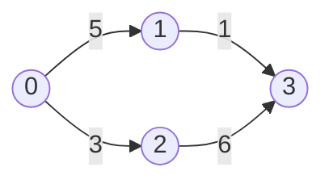

Its adjacency matrix looks like this:

| From / To | 0 | 1 | 2 | 3 |
|:---------:|--:|--:|--:|--:|
| **0** | 0 | 5 | 3 | 0 |
| **1** | 0 | 0 | 0 | 1 |
| **2** | 0 | 0 | 0 | 6 |
| **3** | 0 | 0 | 0 | 0 |

For example:

```text
matrix[0][1] = 5
```

means that there is an edge from node `0` to node `1` with a weight of `5`.

Similarly:

```text
matrix[1][0] = 0
```

means that we haven't stored an edge from node `1` to node `0`.

# The `GraphMatrix` Class

Let's implement it.

```python
class GraphMatrix:

    def __init__(self, num_nodes, undirected=False):
        self.num_nodes = num_nodes
        self.undirected = undirected

        self.connections = [
            [0.0] * num_nodes
            for _ in range(num_nodes)
        ]
```

Creating a graph with four nodes:

```python
>>> matrix = GraphMatrix(4)
```

initializes:

```python
[
    [0.0, 0.0, 0.0, 0.0],
    [0.0, 0.0, 0.0, 0.0],
    [0.0, 0.0, 0.0, 0.0],
    [0.0, 0.0, 0.0, 0.0]
]
```

Every possible pair of nodes receives a position in the matrix.

# Setting an Edge

```python
def set_edge(self, from_node, to_node, weight):
    self._verify_node_indices(from_node, to_node)

    self.connections[from_node][to_node] = weight

    if self.undirected:
        self.connections[to_node][from_node] = weight
```

Let's add an edge.

```python
>>> matrix.set_edge(0, 1, 5)
```

The matrix becomes:

```python
[
    [0.0, 5,   0.0, 0.0],
    [0.0, 0.0, 0.0, 0.0],
    [0.0, 0.0, 0.0, 0.0],
    [0.0, 0.0, 0.0, 0.0]
]
```

# Getting an Edge

```python
def get_edge(self, from_node, to_node):
    self._verify_node_indices(from_node, to_node)
    return self.connections[from_node][to_node]
```

Now:

```python
>>> matrix.get_edge(0, 1)
5

>>> matrix.get_edge(1, 0)
0.0
```

Edge lookup is straightforward because we know exactly where the value is stored.

# Removing an Edge

We can remove an edge by resetting its matrix entry.

```python
def remove_edge(self, from_node, to_node):
    self.set_edge(from_node, to_node, 0.0)
```

If the graph is undirected, `set_edge` automatically clears both directions.

# Complete Adjacency Matrix Implementation

```python
class GraphMatrix:

    def __init__(self, num_nodes, undirected=False):
        self.num_nodes = num_nodes
        self.undirected = undirected

        self.connections = [
            [0.0] * num_nodes
            for _ in range(num_nodes)
        ]

    def __len__(self):
        return self.num_nodes

    def _verify_node_indices(self, from_node, to_node):
        if from_node < 0 or from_node >= self.num_nodes:
            raise IndexError("Source node is out of range")

        if to_node < 0 or to_node >= self.num_nodes:
            raise IndexError("Target node is out of range")

    def get_edge(self, from_node, to_node):
        self._verify_node_indices(from_node, to_node)
        return self.connections[from_node][to_node]

    def set_edge(self, from_node, to_node, weight):
        self._verify_node_indices(from_node, to_node)

        self.connections[from_node][to_node] = weight

        if self.undirected:
            self.connections[to_node][from_node] = weight

    def remove_edge(self, from_node, to_node):
        self.set_edge(from_node, to_node, 0.0)
```

# Adjacency List vs Adjacency Matrix

We now have two representations of the same data structure.

## Adjacency List

```text
0 -> 1, 2
1 -> 3
2 -> 3
3 ->
```

The adjacency list stores only the edges that actually exist.

It is usually a good choice when the graph contains relatively few connections compared with the total number of possible connections.

## Adjacency Matrix

```text
0 5 3 0
0 0 0 1
0 0 0 6
0 0 0 0
```

The adjacency matrix reserves space for every possible connection.

It makes checking a particular node pair straightforward, but it may reserve a lot of unused space.

For a graph with `n` nodes, the matrix contains:

```text
n × n
```

entries even when the graph contains only a handful of edges.

# A Note About Zero-Weight Edges

Our matrix uses `0.0` to represent the absence of an edge.

This creates an important limitation.

What if an actual edge has a weight of zero?

```python
matrix.set_edge(0, 1, 0.0)
```

We can no longer distinguish between:

- A missing edge
- An edge with zero weight

One possible solution is to use `None` instead of `0.0`.

```python
self.connections = [
    [None] * num_nodes
    for _ in range(num_nodes)
]
```

Now:

```python
>>> graph.get_edge(0, 1)
None
```

means:

```text
No edge exists
```

while:

```python
>>> graph.set_edge(0, 1, 0.0)

>>> graph.get_edge(0, 1)
0.0
```

represents a valid edge whose weight happens to be zero.

Small implementation details like this often determine which problems a data structure can solve correctly.

# Adjacency Lists vs Adjacency Matrices

We now have two completely different implementations that represent exactly the same graph.

## Adjacency List


Internally:

```python
0 -> (1, 5), (2, 3)
1 -> (3, 1)
2 -> (3, 6)
3 ->
```

Only existing edges consume memory.

An adjacency list is generally a good choice when the graph contains relatively few edges compared with the total number of possible connections.

Such graphs are often called **sparse graphs**.

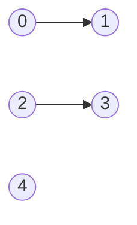

Most real-world graphs are sparse.

Examples include:

- Social networks
- Computer networks
- Road systems
- Dependency graphs

## Adjacency Matrix

The same graph can be represented as:

|   | 0 | 1 | 2 | 3 |
|---|---|---|---|---|
| **0** | 0 | 5 | 3 | 0 |
| **1** | 0 | 0 | 0 | 1 |
| **2** | 0 | 0 | 0 | 6 |
| **3** | 0 | 0 | 0 | 0 |

The matrix stores space for every possible connection.

This makes edge lookups extremely simple:

```python
>>> matrix[0][2]
3
```

However, it also means we may allocate memory for many edges that don't exist.

Consider a graph with:

```text
10,000 nodes
```

An adjacency matrix would require:

```text
10,000 × 10,000
=
100,000,000 entries
```

even if the graph only contains a handful of connections.

# Time Complexity

Let's compare the two representations.

| Operation | Adjacency List | Adjacency Matrix |
|------------|-------------|-------------|
| Add Edge | O(1) | O(1) |
| Remove Edge | O(1) | O(1) |
| Edge Lookup | O(1)* | O(1) |
| Iterate Neighbors | O(k) | O(n) |
| Memory Usage | O(V + E) | O(V²) |

Where:

- `V` = Number of vertices
- `E` = Number of edges
- `k` = Number of neighbors

The adjacency list is usually preferred for large sparse graphs.

The adjacency matrix becomes attractive when:

- The graph is dense
- Fast edge lookups are important
- Memory usage is less of a concern

# Real-World Examples

## Social Networks

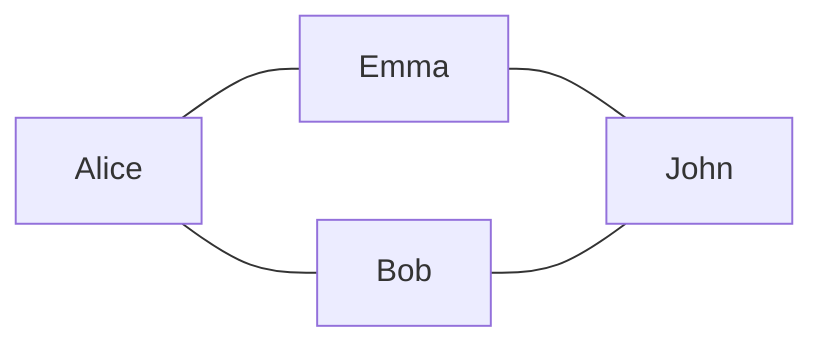

Nodes:

```text
Users
```

Edges:

```text
Friendships
```

## Road Networks

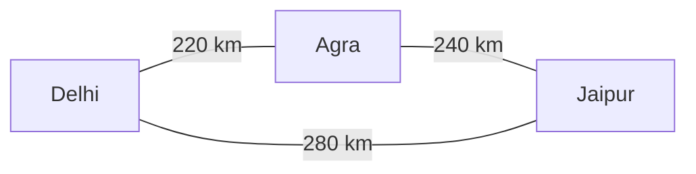

Nodes:

```text
Cities
```

Edges:

```text
Roads
```

Weights:

```text
Distance
```

## Computer Networks

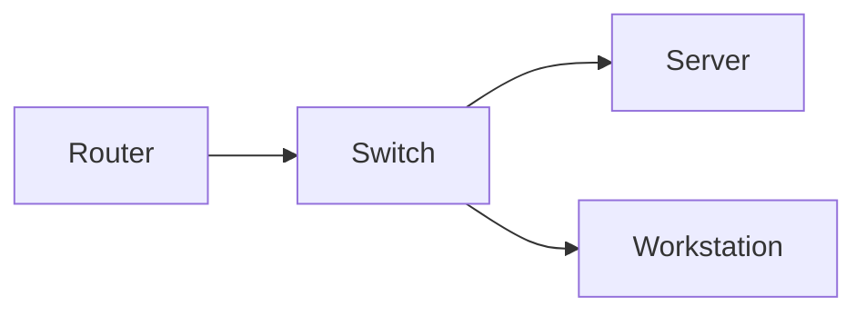

Nodes:

```text
Devices
```

Edges:

```text
Network Connections
```

Weights:

```text
Latency
Bandwidth
Cost
```

## Package Dependencies

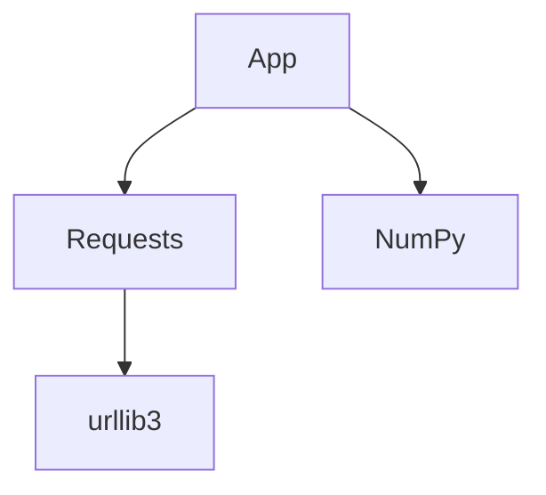

Nodes:

```text
Packages
```

Edges:

```text
Dependencies
```

This structure appears in:

- pip
- npm
- Maven
- Gradle

# Common Graph Algorithms

Now that we have a graph representation, we can begin exploring graph algorithms.

Some of the most useful algorithms include:

### Breadth First Search (BFS)

Explores a graph level by level.

```mermaid
graph TD
    A((A))
    B((B))
    C((C))
    D((D))
    E((E))

    A --> B
    A --> C
    B --> D
    C --> E
```

Used for:

- Finding shortest paths in unweighted graphs
- Web crawlers
- Social network analysis

### Depth First Search (DFS)

Explores one path completely before backtracking.

```mermaid
graph TD
    A((A))
    B((B))
    C((C))
    D((D))

    A --> B
    B --> C
    C --> D
```

Used for:

- Cycle detection
- Path finding
- Topological sorting

### Dijkstra's Algorithm

Finds the shortest path in a weighted graph.

```mermaid
graph LR
    A((A)) -->|4| B((B))
    A -->|1| C((C))
    C -->|2| B
```

We'll eventually combine graphs with our Heap implementation to build this algorithm from scratch.

### Minimum Spanning Trees

Find the minimum cost required to connect all nodes.

Popular algorithms include:

- Kruskal's Algorithm
- Prim's Algorithm

### Topological Sorting

Used to order tasks with dependencies.

```mermaid
graph TD
    Compile --> Test
    Test --> Package
    Package --> Deploy
```

# Oh Yeah, It's All Coming Together

At this point we've implemented:

```python
Edge
Node
Graph
GraphMatrix
```

Along the way we learned about:

```python
Directed Graphs
Undirected Graphs
Weighted Graphs
Adjacency Lists
Adjacency Matrices
Neighbors
Edge Lookups
Graph Traversal
```

Just like our Linked List, Tree, and Heap implementations, the real lesson wasn't simply building a graph.

The real lesson was understanding how different representations can model relationships between objects.

Once you understand graphs, you'll start seeing them everywhere.

```text
Road Maps
Social Networks
Recommendation Engines
Computer Networks
Build Systems
Package Managers
Search Engines
Compilers
Operating Systems
```

Graphs are one of the most versatile data structures in computer science.

And now we have our own implementation.

That's it folks!
