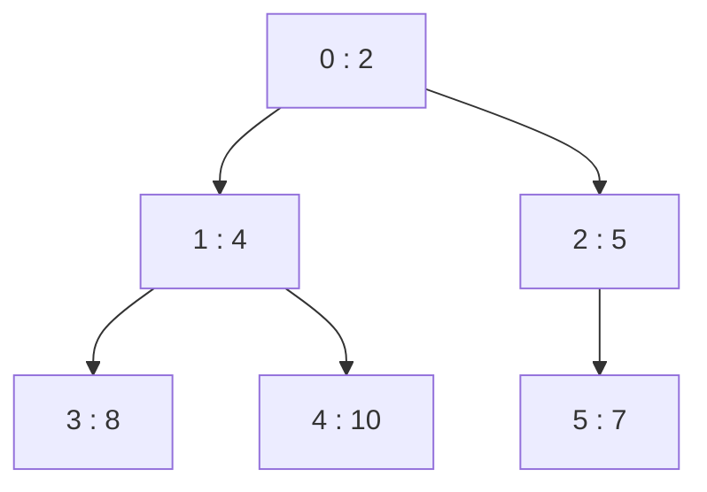
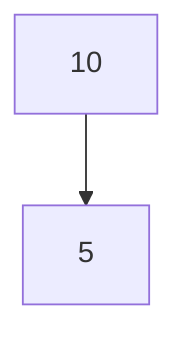
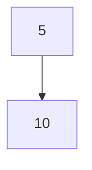
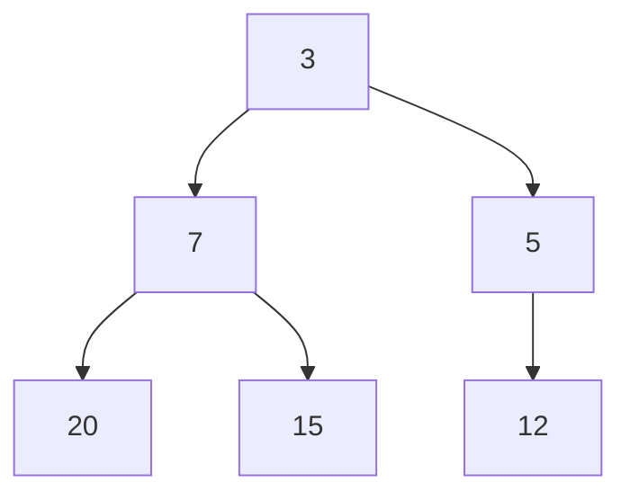
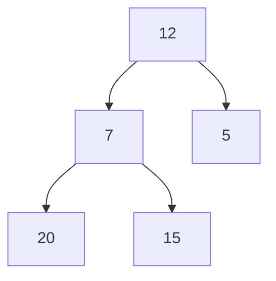

# Implementing a Heap in Python

In this post, we're going to implement a heap data structure from scratch in Python.

Along the way, we'll learn why heaps are useful, how they are represented internally, and how Python's `heapq` module works under the hood.

We'll also leverage the Python Data Model to make our implementation behave like a native Python collection.

## PREREQUISITES

- Familiarity with Python
- Basic understanding of lists
- Some Programming Knowledge

## Goals

- Implement a Min Heap from scratch
- Understand heap operations
- Learn why heaps are efficient
- Explore priority queues
- Use the Python Data Model

---

# What is a Heap?

A heap is a specialized tree-based data structure that satisfies the **Heap Property**.

In a **Min Heap**, every parent node is smaller than or equal to its children.

```text
        2
      /   \
     4     5
    / \   /
   8  10 7
```

Notice that:

```text
2 <= 4, 5
4 <= 8, 10
5 <= 7
```

The smallest element is always at the root.

This allows heaps to efficiently support operations like:

- Finding the minimum element
- Inserting new elements
- Removing the minimum element
- Priority queues
- Task scheduling
- Graph algorithms

---

# A Heap is Actually Just a List

While heaps are typically drawn as trees, most implementations store them inside an array.

For example:

```text
        2
      /   \
     4     5
    / \   /
   8  10 7
```

Can be stored as:

```python
[2, 4, 5, 8, 10, 7]
```

This works because the position of every node determines the position of its children.

For a node at index `i`:

```python
left_child  = 2 * i + 1
right_child = 2 * i + 2
parent      = (i - 1) // 2
```

Let's visualize that.



Pretty neat.

No node objects required.

---

# The Heap Class

Let's create a simple heap.

```python
class Heap:

    def __init__(self):
        self.data = []
```

Creating a heap:

```python
>>> h = Heap()
>>> h.data
[]
```

Nothing exciting yet.

Let's start inserting values.

---

# Inserting Values

Suppose we insert:

```python
10
```

The heap becomes:

```python
[10]
```

Easy enough.

Now let's insert:

```python
5
```

Our array becomes:

```python
[10, 5]
```

But there's a problem.

```text
10
/
5
```

The heap property has been violated.

The parent is larger than the child.

We need to fix it.

---

# Bubble Up

When a new element is inserted, we place it at the end of the array and repeatedly swap it with its parent until the heap property is restored.

This process is called **Bubble Up** (sometimes called Sift Up).



Swap:



The result:

```python
[5, 10]
```

Let's implement it.

```python
def _bubble_up(self, index):

    while index > 0:

        parent = (index - 1) // 2

        if self.data[index] < self.data[parent]:

            self.data[index], self.data[parent] = (
                self        self.data[index]
            )

            index = parent

        else:
            break
```

Now insertion becomes:

```python
def push(self, value):

    self.data.append(value)
    self._bubble_up(len(self.data) - 1)
```

Let's test it.

```python
>>> h.push(10)
>>> h.push(5)
>>> h.push(20)

>>> h.data

[5, 10, 20]
```

Much better.

---

# Building a Heap

Let's insert several values.

```python
>>> h.push(15)
>>> h.push(5)
>>> h.push(3)
>>> h.push(20)
>>> h.push(7)
>>> h.push(12)
```

The resulting heap looks like:



Notice that the smallest value naturally rises to the top.

---

# Finding the Minimum

This is the easiest heap operation.

The minimum element is always:

```python
self.data[0]
```

Let's expose that.

```python
def peek(self):

    return self.data[0]
```

Now:

```python
>>> h.peek()
3
```

Constant time.

No searching required.

---

# Removing the Minimum

Here's where things get interesting.

Suppose we remove:

```text
3
```

from this heap:


The last element takes the root position:



Now the heap property is broken.

We need another balancing operation.

---

# Bubble Down

This time we repeatedly swap the root with its smaller child.

```text
12
/ \
7  5
```

The smaller child is:

```text
5
```

Swap them.

```text
5
/ \
7 12
```

Heap property restored.

Let's implement that.

```python
def _bubble_down(self, index):

    size = len(self.data)

    while True:

        smallest = index

        left = 2 * index + 1
        right = 2 * index + 2

        if (
            left < size and
            self.data[left] < self.data[smallest]
        ):
            smallest = left

        if (
            right < size and
            self.data[right] < self.data[smallest]
        ):
            smallest = right

        if smallest == index:
            break

        self.data[index], self.data[smallest] = (
            self.data[smallest],
            self.data[index]
        )

        index = smallest
```

---

# Implementing Pop

Now we can remove the smallest value.

```python
def pop(self):

    if not self.data:
        raise IndexError("Heap is empty")

    minimum = self.data[0]

    last = self.data.pop()

    if self.data:
        self.data[0] = last
        self._bubble_down(0)

    return minimum
```

Let's try it.

```python
>>> h.pop()
3

>>> h.pop()
5

>>> h.pop()
7
```

Interesting.

The values are coming out in sorted order.

---

# Why Does Heap Sort Work?

Let's repeatedly remove elements.

```python
>>> values = []

>>> while len(h):
...     values.append(h.pop())

>>> values

[3, 5, 7, 12, 15, 20]
```

We accidentally discovered Heap Sort.

The heap is continuously maintaining the smallest element at the root.

Every removal gives us the next smallest value.

---

# Implementing `__len__`

Just like our Linked List implementation, we can integrate with Python's built-in functions.

```python
def __len__(self):
    return len(self.data)
```

Now:

```python
>>> len(h)
6
```

Very Pythonic.

---

# Implementing `__contains__`

```python
def __contains__(self, value):
    return value in self.data
```

Now:

```python
>>> 15 in h
True

>>> 99 in h
False
```

---

# Implementing `__iter__`

Let's allow iteration.

```python
def __iter__(self):
    yield from self.data
```

Now:

```python
>>> for value in h:
...     print(value)
```

works exactly as expected.

---

# Priority Queues

One of the most common uses of a heap is a priority queue.

Suppose we have tasks:

```python
(1, "Production Outage")
(2, "Customer Escalation")
(5, "Update Documentation")
```

Smaller numbers indicate higher priority.

We push them into the heap.

```python
heap.push((1, "Production Outage"))
heap.push((2, "Customer Escalation"))
heap.push((5, "Update Documentation"))
```

Removing elements gives:

```python
>>> heap.pop()

(1, "Production Outage")
```

The most important task always comes first.

This pattern appears everywhere:

- Operating systems
- Job schedulers
- Network routers
- Search algorithms
- Game engines

---

# How Python's `heapq` Works

Python's built-in implementation uses exactly the same ideas.

```python
import heapq

numbers = []

heapq.heappush(numbers, 10)
heapq.heappush(numbers, 5)
heapq.heappush(numbers, 20)
```

The smallest element remains at the front.

```python
>>> heapq.heappop(numbers)

5
```

No magic involved.

Just clever use of arrays and a couple of balancing operations.

---

# Time Complexity

| Operation | Complexity |
|------------|------------|
| Peek | O(1) |
| Insert | O(log n) |
| Remove Min | O(log n) |
| Search | O(n) |
| Build Heap | O(n) |

The logarithmic insert and removal operations make heaps ideal for priority queues.

---

# Conclusion

At this point we've implemented:

```python
push()
pop()
peek()
__len__()
__contains__()
__iter__()
```

All while storing the heap inside a simple Python list.

The real lesson isn't just building a heap.

It's understanding how a relatively simple structure can support efficient operations that power real-world systems like task schedulers, graph algorithms, and operating systems.

Once you understand:

```python
Bubble Up
Bubble Down
Parent Index
Child Index
```

the entire heap data structure becomes surprisingly straightforward.

That's it folks!
