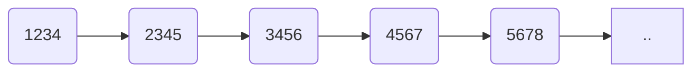
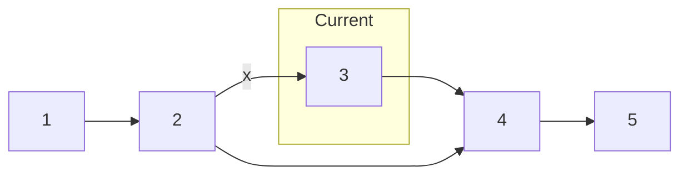

In this post, we are going to learn how to create our own data structures
from scratch using the example of a [Linked List](https://en.wikipedia.org/wiki/Linked_list).

We'll also use the [Python Data Model](https://docs.python.org/3/reference/datamodel.html) to make sure our implementation is consistent with Python's inbuilt data structures. 

#### PREREQUISITES
- Familiarity with Python
- Some Programming Knowledge

#### Goals
- Implement a linked list
- Learn more about the Python Data Model

## Linked Lists

There are very few occasions when you might want to implement a linked list instead of Python's own [list](https://docs.python.org/3/tutorial/datastructures.html#more-on-lists) data structure. However, this simple data structure makes for a great starting point.

A linked list is quite possibly, the simplest example of a [dynamic data structure](https://computer.howstuffworks.com/c27.htm). Linked lists are composed of a chain of nodes liked together by pointers.

### The `Node` Class

A basic **node** in a linked list is a composite data structure containing two parts: a value, and a pointer to the next node in the list.

```py
class Node:
  def __init__(self, input_data, next_node=None):
    self.data = input_data
    self.next = next_node
```
To create a `Node` object:

```py
>>> temp = Node(90)
>>> temp.data
90
```

If you are coming from other languages, you may be tempted to add getters and setters to the class like below.

```py
class Node:
    def __init__(self, input_data, next_node=None):
        self.data = input_data
        self.next = next_node

    def get_data(self):
        return self.data

    def get_next(self):
        return self.next

    def set_data(self,new_data):
        self.data = new_data

    def set_next(self,new_next):
        self.next = new_next
```
> This usually considered a good practice in other languages, but in Python, this would actually be considered [non-pythonic](https://stackoverflow.com/questions/25011078/what-does-pythonic-mean).

A linked list can be visualized as a series of linked boxes, as seen in the below picture:


> While we often represent linked lists as a neat, orderly structures, our list can actually be scattered throughout the program's memory.

Because they include pointers as well as values, linked lists typically require more
memory to store the same items than C-style arrays. Instead of the absolute position, emphasis in a linked list is generally on the relative position of each element.

Now, let's create the `LinkedList` class.

```py
class LinkedList:
  def __init__(self, head=None):
    self.head = head
    self.count = 0
    if self.head:
      self.count = 1
```
This will enable us to create a list like such:

```py
>>> new_list = LinkedList()
>>> new_list.head
None
```
There are no members here. Let's create the ability to add elements to the list.

```py
def add(self, data):
  temp = Node(data)
  temp.next = self.head
  self.head = temp
  self.count += 1
```
Notice that we are adding new members at the front of the linked list. First, we create a new `Node` object with data provided by the user and `next` is the `head` of our linked list. The newly added member now becomes our new `head`.


```py
>>> lst = LinkedList()
>>> lst.add(42)
>>> lst.add(53)
>>> lst.add(67)
>>> lst.add(89)
>>> lst.add(90)
>>> lst.head.data
90
```

We have also created a variable to keep track of the size of our list. To get the size, we could reference the `count` variable directly:

```py
>>> lst.count
5
```

But here's a neat trick: we can leverage the Python Data Model so our users don't have to remember the arbitrary names for standard operations. Is it `.size()`, `.length()`, or what?

Let's implement the `__len__` method.

```py
def __len__(self):
  return self.count
```

This way, just like any other Python data structure, the user can call `len()` to get the size of our linked list.

```py
>>> len(lst)
5
```

The next methods that we will implement are based on the technique known as **linked list traversal**. We will visit each node in the linked list, starting from the head, using the references stored in the `next` variable of each node.

Let's implement the `__contains__` method using this technique.

```py
def __contains__(self, value):
  current_node = self.head
  while current_node:
    if current_node.data == value:
      return True
    else:
      current_node = current_node.next
  return False
```

In this method, while we visit each node, we also check if the value provided is equal to the data stored in the `current_node`. If we get a match, we return `True`, otherwise, the loop ends after the last node and we return `False`.

```py
>>> 42 in lst
True
>>> 43 in lst
False
```

I hope you are getting the hang of it by now. The special methods (also called dunder methods) allow us to implement our classes in a way that is consistent with Python collections.

Using the same approach, we can also implement the `__getitem__` method. Which returns the value of a node by its position.

```py
def __getitem__(self, pos):
  current_node = self.head
  if pos >= self.count:
      raise IndexError("List index out of range")
  for i in range(pos):
      current_node = current_node.next
  return current_node
```

Now, we can do this:

```py
>>> lst[0]
<ll.Node object at 0x00000195DF1412E0>
```
> Oops!

```py
>>> lst[0].data
90
```
Let's make a little change to the `Node` class just so that it all fits a little better.

```py
class Node:

  def __init__(self, input_data, next_node=None):
    self.data = input_data
    self.next = next_node

  def __repr__(self):
    return str(self.data)
```

Implementing the `__repr__` function allows us to dictate the str representation of our objects. So now when we do this:

```py
>>> lst[0]
90
```

> Oh Yeah, It's All Coming Together

Now, I'll show you the real power of these three methods.

First, let's loop over the nodes:

```py
>>> for i in lst:
...   print(i)
...
90
89
67
53
42
```

Also, this just works:

```py
>>> for i in reversed(lst):
...   print(i)
...
42
53
67
89
90
```

Want to convert our list to a `dict`?

```py
>>> d = {(k, k.next) for k in lst}
>>> d
{(89, 67), (53, 42), (42, None), (90, 89), (67, 53)}
```

> We just created a Directed Acyclic Graph (DAG)!

Want to select a random element from our list?

```py
>>> from random import choice
>>> choice(lst)
53
```

The last method we will implement is the `remove` method. First, we will traverse the list looking for the item that we want to remove. Once we find the item, we must remove it.

Finding the item is very similar to the `__getitem__` method but how do we remove it? One approach is to delete the data but keep the node. This isn't recommended because it may break our other methods. The best approach would be to remove the node altogether, like so.



Here, we can set the next of the second node to the fourth node and that's it, our node is deleted. However, once we match with the third node, we will no longer have the second node stored in the traversal technique. We can modify it to store the previous node as well.

```py
def remove(self, value):
  current_node = self.head
  previous_node = None
  while current_node:
    if current_node.data == value:
      break
    else:
      previous_node = current_node
      current_node = current_node.next

  if previous_node:
    previous_node.next = current_node.next
  else:
    # node to delete is the first node
    self.head = current_node.next  
```

That's it folks!  

[Here's](https://gist.github.com/paravsingla/00dacc479516f1444fbd89b2f01859c1) the full code.

Leave a comment if you liked the article!