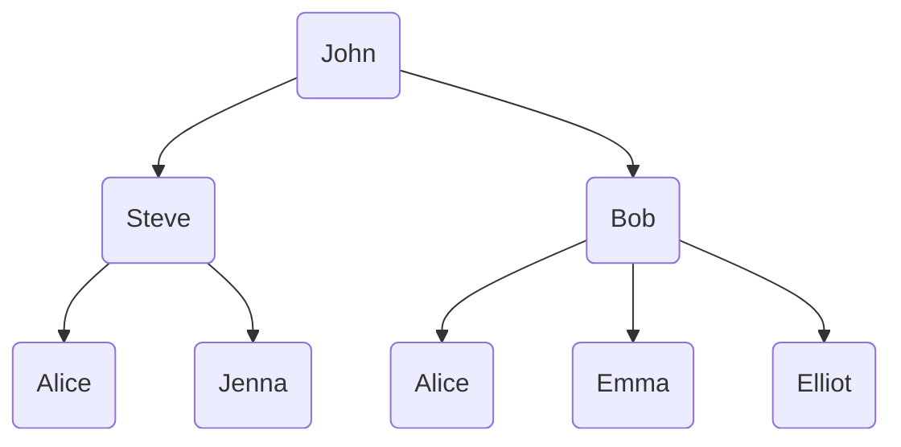

In this article, we are going to implement a [tree]() data structure in Python. We'll see how to use the [Python Data Model]() so that our implementation is consistent with other data structures in Python. 

#### PREREQUISITES
- Familiarity with Python
- Some Programming Knowledge

#### Goals
- Implement a tree
- Learn more about the Python Data Model

## Trees

Trees are used in many areas of computer science, including operating systems, graphics, database systems, and computer networking. Tree data structures have many things in common with their botanical cousins. A tree data structure has a root, branches, and leaves. The difference between a tree in nature and a tree in computer science is that a tree data structure has its root at the top and its leaves on the bottom.

Here's an example:

Notice that all of the children of one node are independent of the children of another node. You can learn more about trees and the different types [here](https://en.wikipedia.org/wiki/Tree_(data_structure)).

