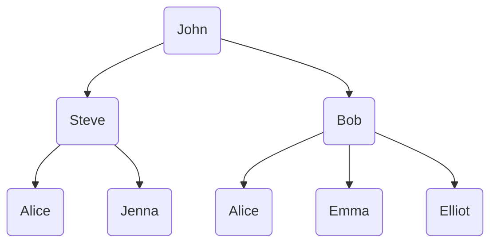

In this article, we are going to implement a [tree]() data structure in Python. We'll see how to use the [Python Data Model]() so that our implementation is consistent with other data structures in Python. 


#### PREREQUISITES
- Familiarity with Python
- Some Programming Knowledge

#### Goals
- Implement a tree
- Learn more about the Python Data Model

## Trees

Trees are used in many areas of computer science, including operating systems, graphics, database systems, and computer networking. Tree data structures have many things in common with their botanical cousins. A tree data structure has a root, branches, and leaves. The difference between a tree in nature and a tree in computer science is that a tree data structure has its root at the top and its leaves on the bottom.

Here's an example:


```mermaid

graph TD
3(John)
3 --> 5(Steve)
3 --> 7(Bob)
7 --> 9(Alice)
7 --> 11(Emma)
7 --> 8(Elliot)
5 --> 13(Alice)
5 --> 15(Jenna)
```

Notice that all of the children of one node are independent of the children of another node. You can learn more about trees and the different types [here](https://en.wikipedia.org/wiki/Tree_(data_structure)).

## The TreeNode Class

Just like our Linked List implementation, we'll start with a simple node class.

A tree node stores two things:

- A value
- A collection of child nodes

Unlike a linked list node, which only stores a reference to the next node, a tree node can have any number of children.

```python
class TreeNode:

    def __init__(self, data):
        self.data = data
        self.children = []
```

Let's create a few nodes.

```python
>>> john = TreeNode("John")
>>> john.data
'John'
```

Just like before, if you're coming from another language, you might be tempted to add getter and setter methods.

```python
john.get_data()
john.set_data("Bob")
```

As discussed in the previous article, this is generally considered non-pythonic. In Python we typically access attributes directly unless we have a good reason not to.

Now let's create part of the family tree shown earlier:

```python
>>> john = TreeNode("John")
>>> steve = TreeNode("Steve")
>>> bob = TreeNode("Bob")

>>> john.children.append(steve)
>>> john.children.append(bob)
```

This gives us:

```text
John
├── Steve
└── Bob
```

Not bad, but manually manipulating the children list feels a little awkward.

Let's add a helper method.

```python
def add_child(self, child):
    self.children.append(child)
```

Now we can write:

```python
>>> john.add_child(steve)
>>> john.add_child(bob)
```

Much better.

## The Tree Class

While we could work entirely with nodes, it is often useful to wrap everything inside a Tree class.

```python
class Tree:

    def __init__(self, root=None):
        self.root = root
        self.count = 1 if root else 0
```

Creating a tree is straightforward:

```python
>>> family_tree = Tree(john)
>>> family_tree.root
John
```

Oops!

That doesn't quite work yet.

Python doesn't know how to display our objects.

Let's fix that.

## Implementing `__repr__`

We'll add a string representation to our node.

```python
class TreeNode:

    def __init__(self, data):
        self.data = data
        self.children = []

    def __repr__(self):
        return str(self.data)
```

Now:

```python
>>> family_tree.root
John
```

That's a little nicer.

## Finding the Size of a Tree

We already have a count variable.

Let's expose it using the Python Data Model.

```python
def __len__(self):
    return self.count
```

Now users can write:

```python
>>> len(family_tree)
8
```

instead of:

```python
>>> family_tree.count
8
```

This keeps our implementation consistent with Python collections.

## Tree Traversal

A linked list only has one path through the data.

Trees are a little more interesting.

There are many different ways to visit every node in a tree.

The simplest approach is a Depth First Traversal.

We visit:

1. The current node
2. Its first child
3. That child's children
4. And so on

Let's implement it using a generator.

```python
def _traverse(self, node):

    yield node

    for child in node.children:
        yield from self._traverse(child)
```

Notice the use of `yield from`.

This allows us to recursively delegate part of the iteration to another generator.

Now let's connect it to Python's iteration protocol.

```python
def __iter__(self):

    if self.root:
        yield from self._traverse(self.root)
```

And now for the fun part.

```python
>>> for node in family_tree:
...     print(node)

John
Steve
Alice
Emma
Bob
Elliot
Alice
Jenna
```

We can now iterate over our custom tree exactly like we iterate over lists and tuples.

## Implementing `__contains__`

Let's make membership testing work too.

```python
def __contains__(self, value):

    for node in self:
        if node.data == value:
            return True

    return False
```

Which lets us write:

```python
>>> "Emma" in family_tree
True

>>> "Michael" in family_tree
False
```

The real beauty here is that we're reusing our iterator implementation.

Whenever possible, try to build new functionality on top of existing functionality.

Your future self will thank you.

## Oh Yeah, It's All Coming Together

At this point we've implemented:

```python
>>> len(family_tree)
8

>>> "Emma" in family_tree
True

>>> list(family_tree)
[John, Steve, Alice, Emma, Bob, Elliot, Alice, Jenna]
```

All by implementing a handful of special methods from the Python Data Model.

Just like our Linked List implementation, the real goal wasn't simply creating a tree data structure.

The real lesson was learning how Python collections integrate with functions such as:

```python
len()
list()
for
in
```

By implementing methods like:

```python
__repr__
__len__
__iter__
__contains__
```

our custom classes become first-class Python citizens.

That's it folks!


